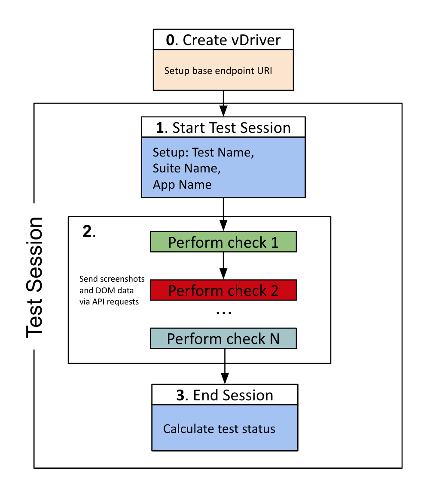

## SDK for Syngrisi tool

### Base Flow Overview
There is 3 basic step for particular test:


### Installation
```shell script
npm i @syngrisi/syngrisi-wdio-sdk --save-dev
```
### Usage Example

```javascript
const syngrisi = require('@syngrisi/syngrisi-wdio-sdk');
const vrsHost = 'localhost';
const vrsPort = 3000;
const VRSConfig = {
    url: `http://${vrsHost}:${vrsPort}/`
}
const {remote} = require('webdriverio');

;(async () => {
    global.browser = await remote({
        capabilities: {browserName: 'chrome'}
    })
    // 0. Add Syngrisi driver to browser object
    browser.vDriver = new syngrisi.vDriver(VRSConfig);

    // 1. Start Syngrisi test session
    await browser.vDriver.startTestSession({
        app: 'Test Application',
        test: 'My first Syngrisi test',
        suite: 'My first Syngrisi suite'
    });

    await browser.navigateTo('https://www.google.com/ncr')

    // 2.1. perform visual check
    const screenshot = new Buffer(await browser.takeScreenshot(), 'base64');

    await browser.vDriver.checkSnapshoot(
        'My Check',
        screenshot
    );

    const searchInput = await browser.$('[name=q]');
    await searchInput.setValue('Σύγκριση');

    const searchBtn = await browser.$('input[value="Google Search"]');
    await (searchBtn.waitForClickable())
    await searchBtn.click();

    // 2.2 perform another visual check
    const screenshot2 = new Buffer(await browser.takeScreenshot(), 'base64');

    await browser.vDriver.checkSnapshoot(
        'My another Check',
        screenshot2
    );

    // 2.3 stop test Session
    await browser.vDriver.stopTestSession();

})().catch((err) => {
    console.error(err)
    throw err
}).finally(() => browser.deleteSession());
```

### TODO 
* Add complete SDK API documentation
